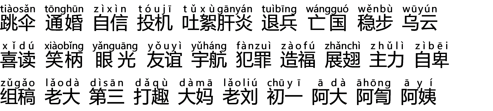

# Day2作业：变调 + 轻重格式

 2022-3-29 03:28:49

**上声音节变调有如下规律：**

(1)上声音节单念或在句尾时不变，仍读本调。

(2)上声音节在阴平、阳平、去声和轻声音节前，其调值214变为21，也记作211(即所谓“半上”)，例如:

**(3)上声音节与上声音节相连，前面一个音节的调值由214变为接近35(即所谓阳上)。**例如:

**“一"“不"变调的发音练习**

**双音节词的轻重格式及发音训练**

在普通话中，双音节词轻重格式有三种，其中以中重格式最多。

**(1)中重格式:**

**(2)重中格式:**

**(3)重轻格式:**

普通话三音节词轻重格式一般有三种：

**(1)中中重**

**(2)中重轻**

**(3)中轻重**

**中重中重练习**

大部分具有联合关系的四字格式成语及少量其他结构关系的四字格式成语要读做中重中重格式。

**中轻中重练习**

**重中中重练习**

