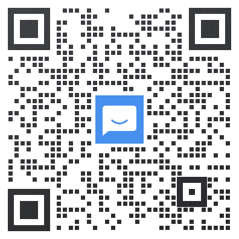
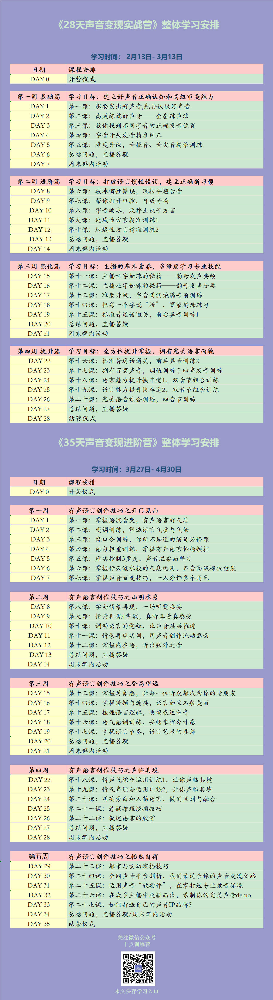

# 开营学习须知

## 1 购课后须知

1. 扫描二维码添加十点老师（`鹿班1(声音客服)_十点读书`），再根据提示进入 12 期 6 班的班级群——

添加十点老师：

添加班级群：

2. 关注 **十点训练营**，在【我的课程-已购课程】查看本课程，永久保存上课入口

## 2 学习总体安排

## 3 社群学习形式

### 1 群内发音练习（`每天 7:30` / `任意时间`）

改变声音必须开口练习。班主任先在群内发布示范视频（`1~3分钟`），学员学习模仿后，以 **微信语音** 的形式将练习发到群内，会有助教随机点评（如果错过时间，也可以 **任意时间** 在群内自主练习）；

### 2 音频视频自学（`全天任意时间`）

每天 7:30 班主任群内发上课地址，授课内容为平均 `15~25 分钟`的音视频录播课；（也可在【十点训练营-我的课程】中自主观看）

### 3 直播授课（`周六 20:00`）

老师直播授课

### 4 群内互动

1. 干货分享：`每天 14:00` 班主任在群内分享
2. 群内课程总结：`每天 21:00` 班主任发布当日学习笔记、明日学习预告
3. 周末主题活动：`每周日` 群内小组 PK 赛

## 4 FAQs

问：课程可以回看吗？

答：可以的，班主任会在每天学习结束后，上传所有内容到课程里，以供永久回看。（需关注 **十点训练营** 公众号，从已购课程进入）。

问：学习时间如果有冲突，错过学习怎么办？

答：每天所有的学习环节如果赶不上，都可以在其它时间回看。其中 **发音练习** 环节会有集中点评，如若错过可在群里提问。