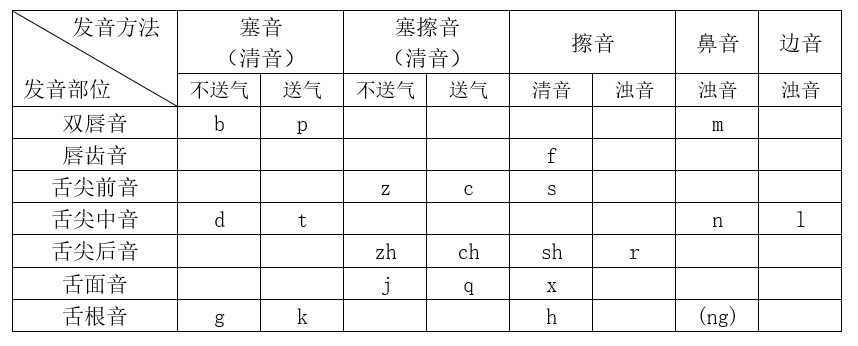
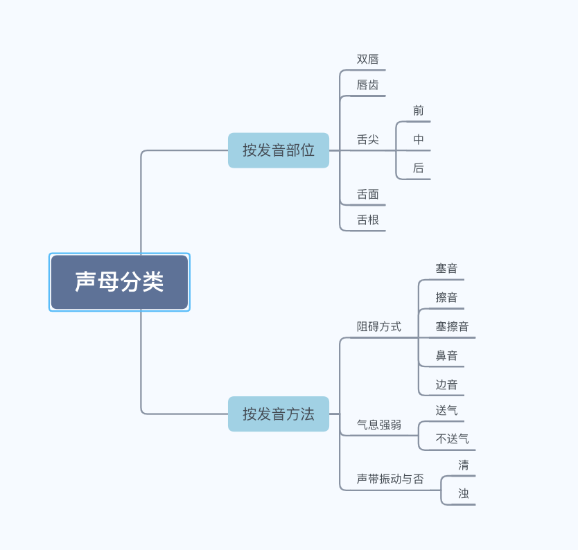

# Day3发音练习：教你找到不同字音的正确发音位置

2022-3-31 01:09:25

**【实操作业】**

声母练习，课堂上每一个字跟读三遍，然后录一遍，对比听，找差异。

**【学习要点】**

21 个声母：`b`、`p`、`m`、`f`、`d`、`t`、`n`、`l`、`g`、`k`、`h`、`j`、`q`、`x`、`zh`、`ch`、`sh`、`r`、`z`、`c`、`s`

21 个辅音声母分类：

**一、按发音部位分类**

1. 双唇阻：上唇与下唇成阻。声母有 `b`、`p`、`m`。
2. 唇齿阻：上门齿与下唇成阻。声母有 `f`。
3. 舌尖前阻：舌尖与上门齿背成阻。声母有 `z`、`c`、`s`。
4. 舌尖中阻：舌尖与上门齿龈成阻。声母有 `d`、`t`、`n`、`l`。
5. 舌尖后阻：舌尖与前硬腭成阻。声母有 `zh`、`ch`、`sh`、`r`。
6. 舌面阻：舌面前部与硬腭前部成阻。声母有 `j`、`q`、`x`。
7. 舌根阻：舌根与硬腭软腭交界处成阻。声母有 `g`、`k`、`h`。

**二、按发音方法分类**

1. 塞音：声母有b、`p`、`d`、`t`、`g`、`k`。
2. 擦音：声母有f、`h`、`x`、`s`、`sh`、`r`。
3. 塞擦音：声母有 `j`、`q`、`zh`、`ch`、`z`、`c`。
4. 鼻音：声母有 `m`、`n`，鼻辅音 `ng`。
5. 边音：声母有 `l`。

**三、送气与否**

1. 不送气音：发音时呼出气息微弱，声母有 `b`、`d`、`g`、`j`、`zh`、`z`。
2. 送气音：发音时呼出气流较强，有喷发出口的感觉，声母有 `p`、`t`、`k`、`q`、`ch`、`c`。

**四、清浊的区分**

1. 浊音：发音时声带颤动，声母有 `m`、`n`、`l`、`r`。
2. 清音：发音时声带不振动，声母有 `b`、`p`、`f`、`d`、`t`、`g`、`k`、`h`、`j`、`q`、`x`、`zh`、`ch`、`sh`、`z`、`c`、`s`。

