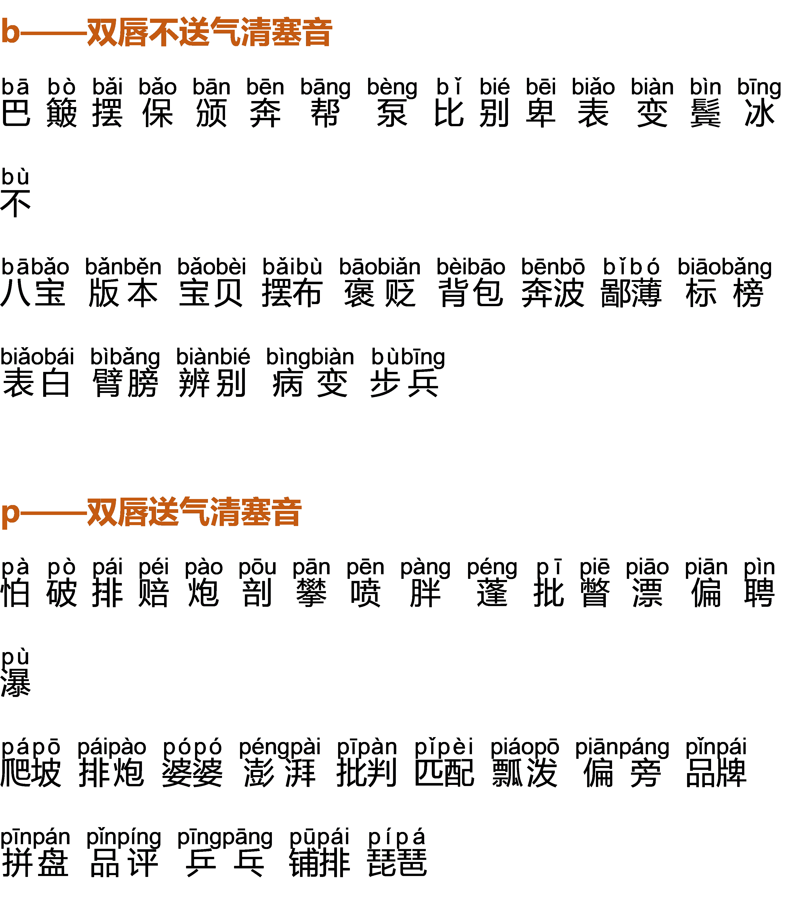
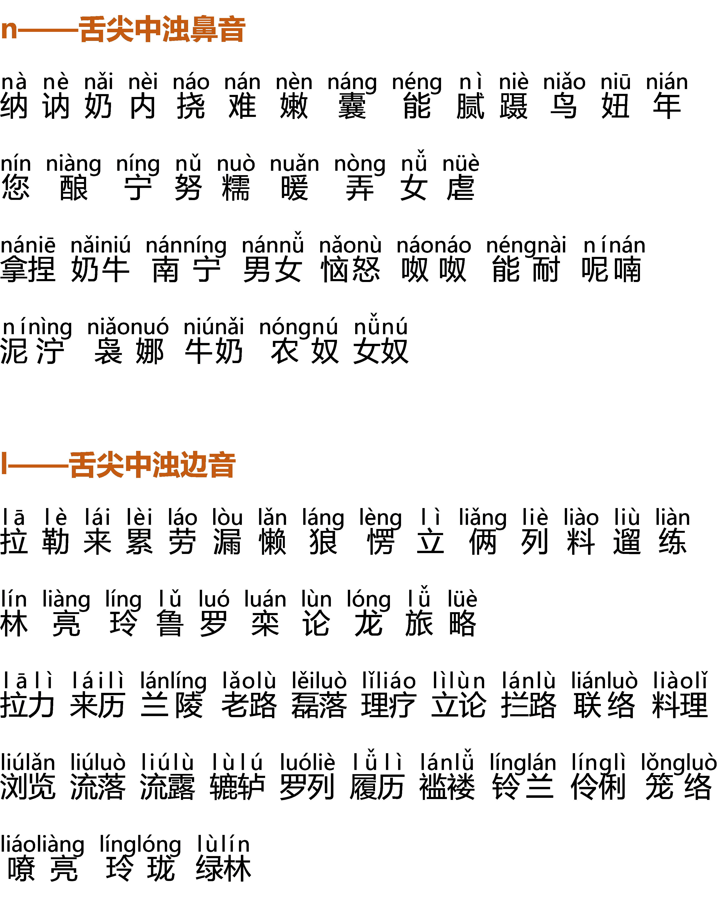

# Day4发音练习：字音开头发音精准纠正

2022-3-31 22:38:53

**【实操作业】**

单字词、二字词跟读三遍，然后录下来，对比听，找差异。

**【学习要点】**

**一、如何练习做到口齿清晰？** 

坚持每天练习口部操（唇部操+舌部操），很多人口齿不清晰是因为唇舌无力。

具体的口部操示范可见表达课第四课。

**二、什么是枣核形的吐字归音动程？**

如果把每一个字都吐字归音到位，就可以拥有动听的、悦耳的、令人愉悦的声音气质。

无论是练习一个字、二字词、四字词或文章，都要在脑子里有动程的形成过程。每一个字、词都是一个枣核，都要发完全。可以通过拉开练习进行训练。前期练习的时候在发音时用手比划着枣核形帮助意识的建立。

**三、什么是拉开练习？**

只有发音时先拉开练习，才能收得回去，形成一种收放自如的语言状态。

**四、什么是声挂前腭？**

气息由小腹上升，通畅的发到软腭，再由软腭奔向硬腭，挂在前面。

**五、什么是挺软腭？打牙关？**

发音的时候软腭抬起，也就是小舌那块抬起，打开口腔共鸣，打开牙关，使发音更加完整、饱满。可以通过打哈欠找挺软腭的感觉，打开口腔，打开牙关。

**六、字词练习的注意事项**

1. 有些词是多音字
2. 有些词要做轻声处理，后期会学习到
3. 注意练习时要声挂前腭及枣核形的吐字流程
4. 练习双唇阻声母，应该要唇部中央用力，不要裹唇、不要撅唇
5. 唇齿音只有f一个音，在发音的时候牙齿会和嘴唇接触到

**慢就是稳，稳就是快。**

**【练习材料】**

