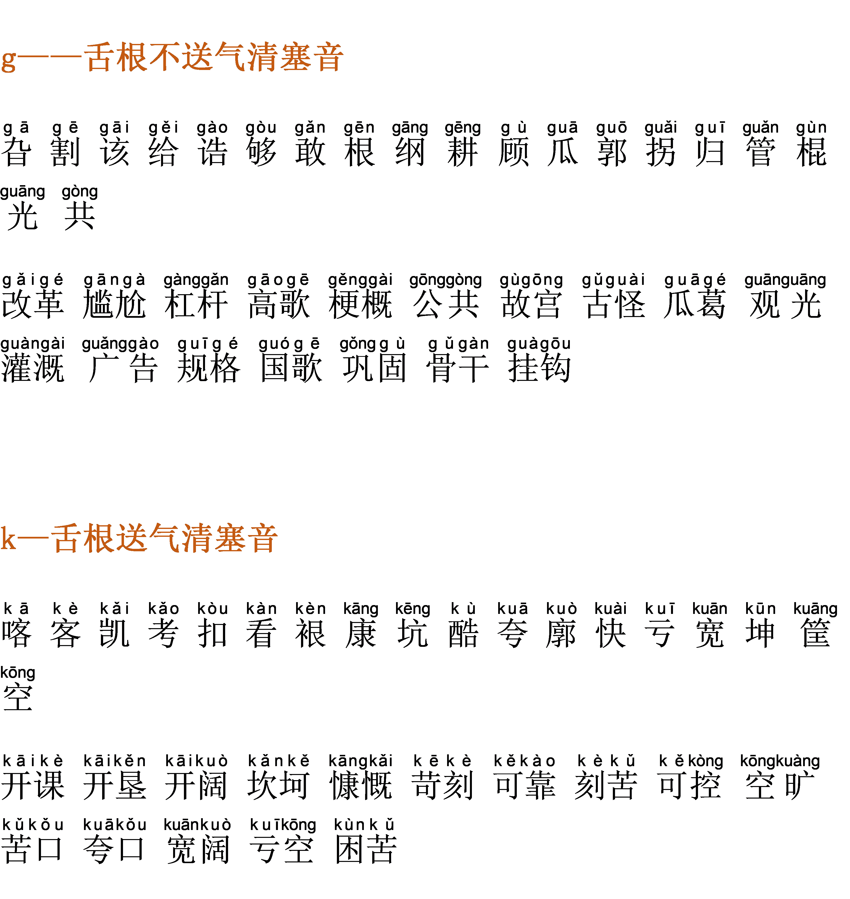
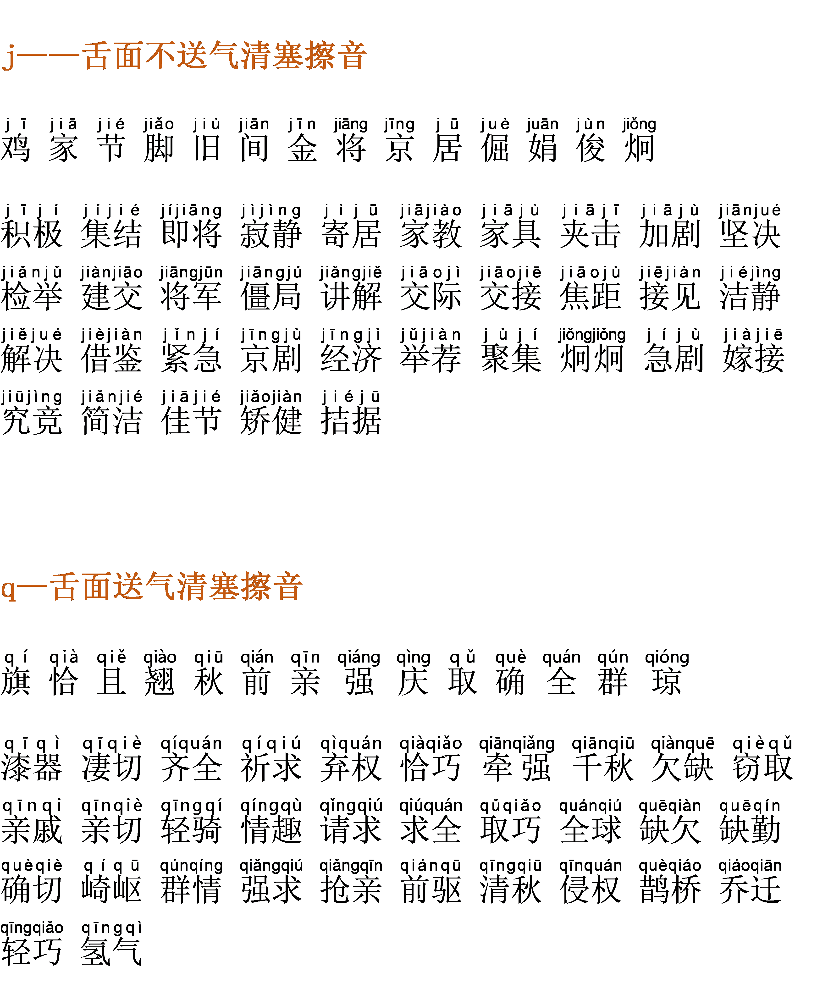

# Day5发音练习：难度升级，舌根音，舌面音精修训练

2022-4-4 20:08:08

**【实操作业】**

本课字词模仿三遍，第四遍录音，对比听，找差距。

**【学习要点】**

**一、气息（复习）**

身体像一个通道，气息由小腹上来，经由胸腔到达喉腔，再到达软腭，由软腭弹出到硬腭，这期间是一个笔直的通道，在发声时尽量少的用嗓子。

**二、练习后正确和错误的感觉分别是什么？**

正确：练声后会感觉浑身累但是又很通畅，嗓子、声带不会感觉累。

错误：练习后嗓子痛、嗓子紧，总想咳嗽。

**三、舌根音—— `g`、`k`、`h`**

声母中最靠后的三个字母，发音时不能压喉会对声带造成伤害，而且这样的声音气质是暗沉、不够积极、不够明亮。注意要后音前发，发音要完整，提颧肌、打牙关、挺软腭、松下巴，体会枣核形的吐字流程，体会声挂前腭的积极感。

舌根轻轻抬起跟软硬腭交界处形成阻碍，用气息除阻发声。

 

**四、舌面音—— `j`、`q`、`x`**

舌面音发音靠前，容易产生噪音。在发音时要注意舌根不要使劲，舌根舌面都要放松，舌头不要碰到牙齿、不要放到牙齿之间，避免产生尖音。注意发音要完整，提颧肌、打牙关、挺软腭、松下巴，体会枣核形的吐字流程，体会声挂前腭的积极感。

相信肌肉的力量，相信大脑的力量，相信时间的力量。

**【练习材料】**

**1. 舌根音：**

**2. 舌面音：**

