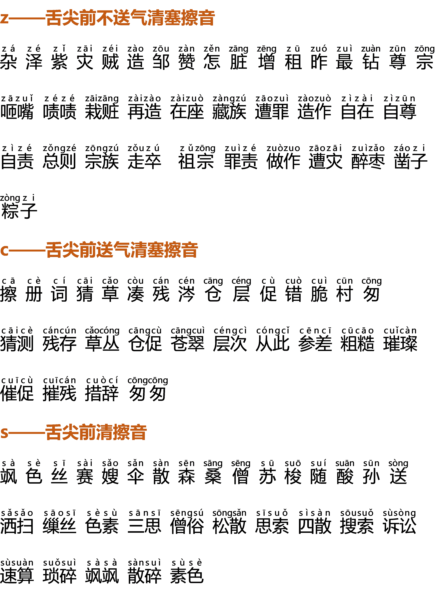
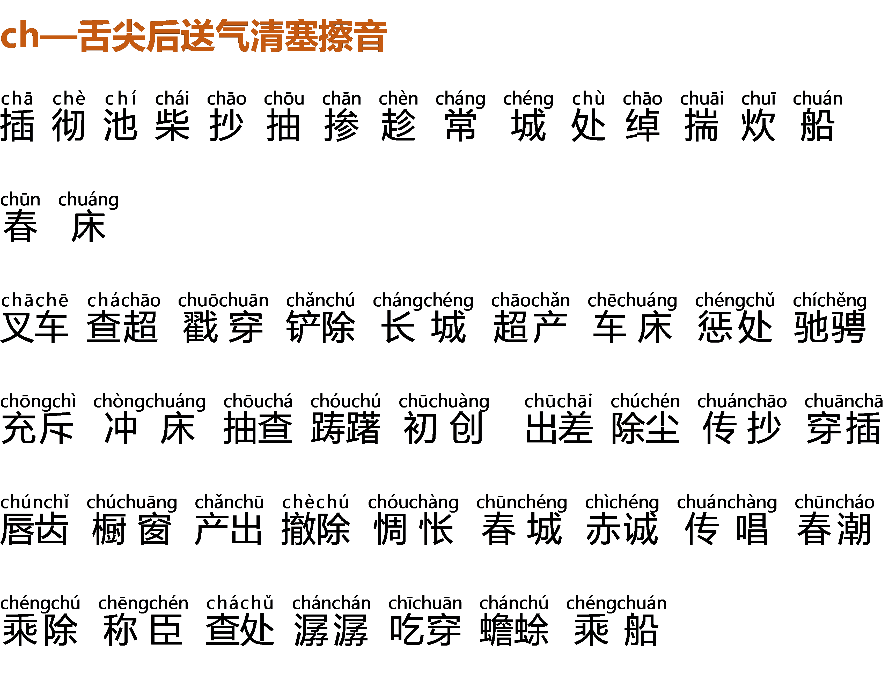
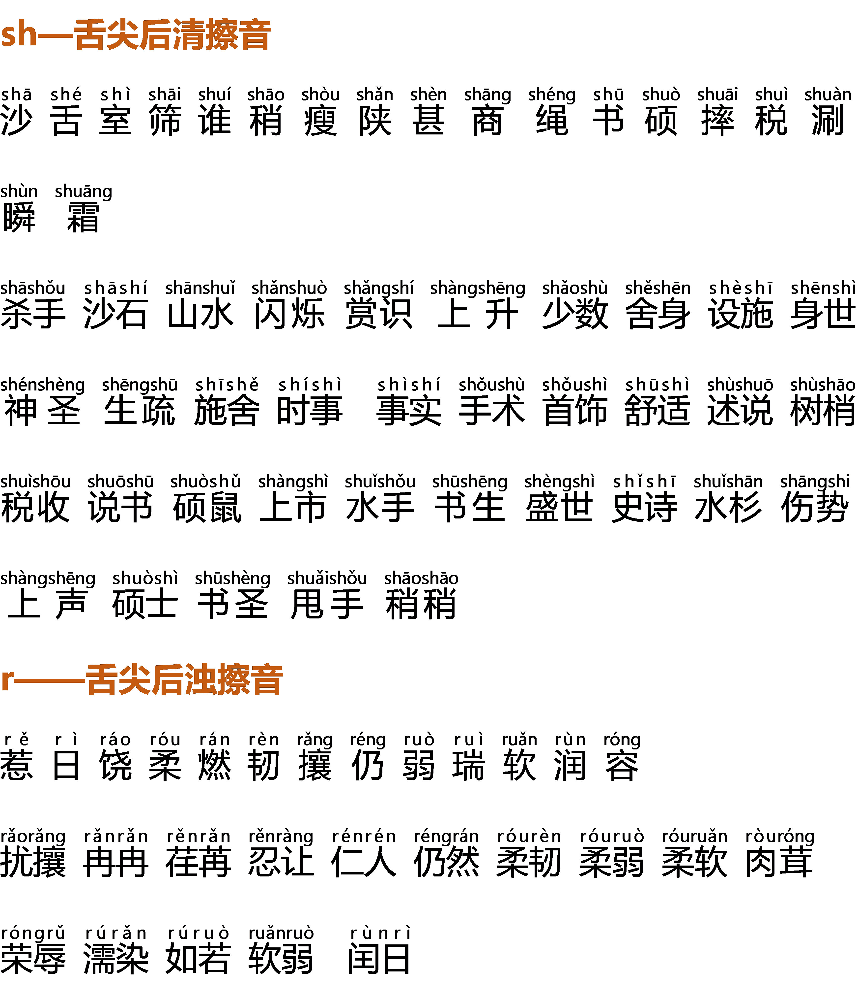

# Day9发音练习：帮你打开口腔，自成音响

2022-4-5 12:54:08

**【实操作业】**

跟读三遍，录下来，找差异。

**【学习要点】**

**一、为什么选择在早上练声？**

可以唤醒你的意识、唤醒你的身体、唤醒你的气息和肌肉。

**二、如何开嗓？**

1. 建议站着练习，如果坐着练习，要背部挺直坐在椅子的 1/3 处
2. 气息练习——闻花香发 `sī`
3. 气泡音寻找中音区——闻花香发气泡音，由气泡音逐渐发出实音
4. 横膈肌练习——闻花香发 **嘿**（每吸一口气，发一个嘿）

**三、练习气息应注意什么？**

吸气时感受两边肋骨、后腰撑起，控制住气息一点点呼气，中间不能偷气唤气，不能用嗓子发s，如果暂时不能控制嗓子可以先不发s只慢慢的呼气。

**四、为什么有时发不出气泡音，或者只有早上能发出气泡音？**

气息不够或者还没有找到正确的方法都有可能造成发不出气泡音。

经过一夜的休息，嗓子在早上是最放松、最容易发出气泡音的。在整体状态不好或疲惫的状态下很难发出气泡音或发出的气泡音会不够饱满。

**五、舌尖前音—— `z`、`c`、`s`**

发音的时候舌尖端抵住上齿背或下齿背，顶尖接触一碰就走，要轻盈，注意前音后发。不要使很大的劲，避免发出刺耳的噪音。舌尖不要放在牙齿中间，会漏风并产生噪音。

**六、舌尖后音—— `zh`、`ch`、`sh`、`r`**

发音的时候舌尖稍稍翘起，不要卷舌，发音注意不要太靠后。

**七、练习发音要注意什么？**

从开口的那一刻起，要使用正确的呼吸方法，保持提打挺松——提颧肌、打牙关、挺软腭、松下巴，抛物线式的枣核式的吐字方式，声挂前腭的轻松感。

我们应当把后天所学到的那些好的知识、美好的品格和积累内化为我们的性格，让它在这个过程当中成就我们自己。

**【练习材料】**

