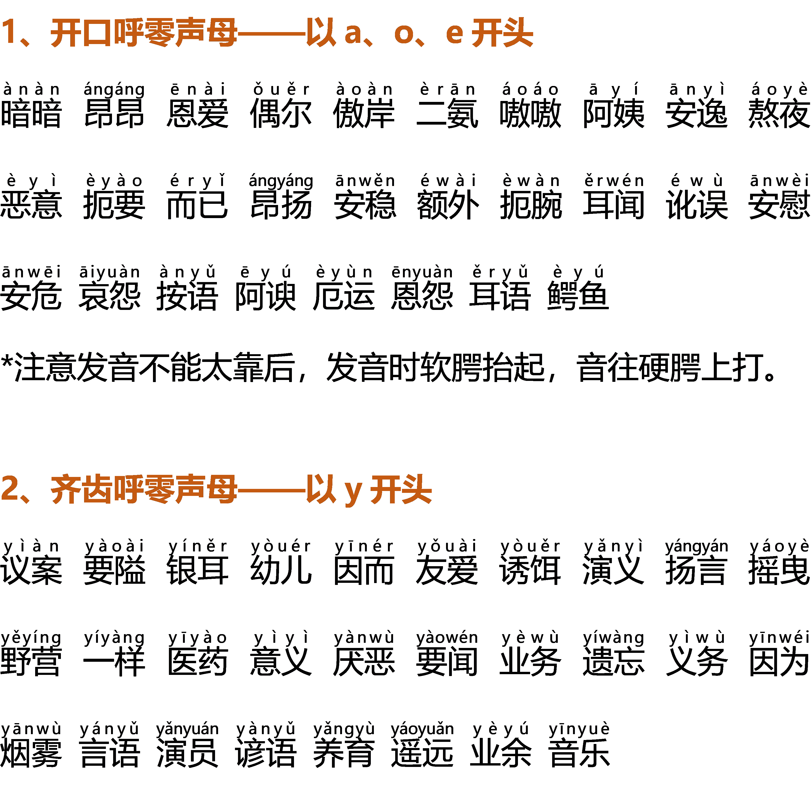
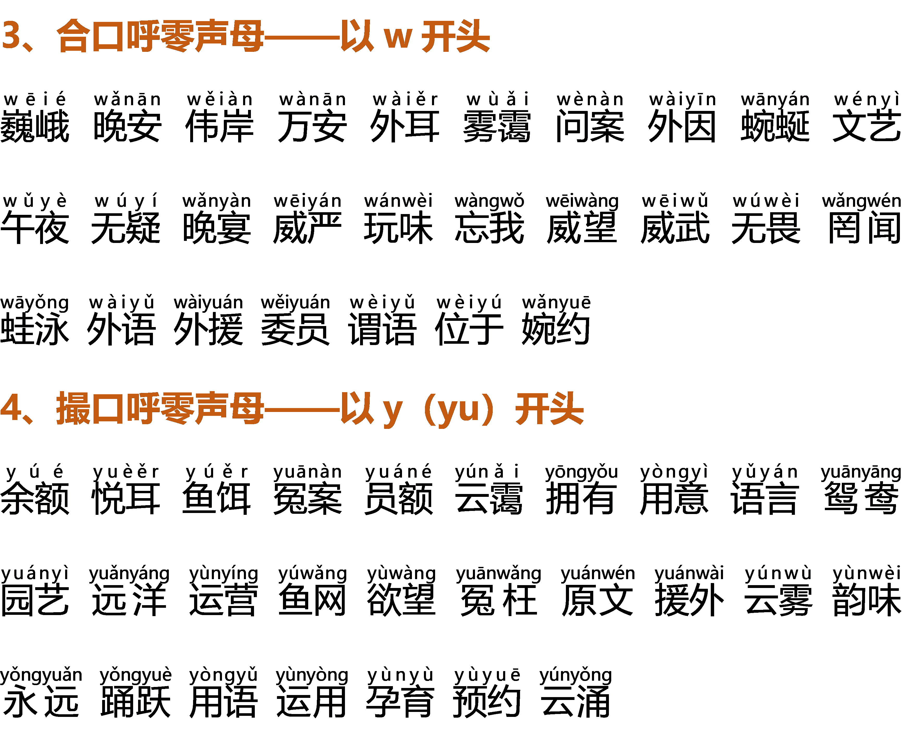

# Day9发音练习：帮你打开口腔，自成音响

2022-4-5 12:54:08

**【实操作业】**

听两遍，模仿一遍录制音频，发到作业上，听助教老师点评，找到问题所在。

不要一味的依赖助教老师，在学习的过程中要练出一副能分辨差距的好耳朵。

**【学习要点】**

**一、绕口令练习**

学好声韵辨四声，阴阳上去要分明。

部位方法须找准，开齐合撮属口型。

双唇班抱必百波，抵舌当地斗点钉。

舌根高狗工耕故，舌面机结教坚精。

翘舌主争真志照，平舌资责早在增。

擦音发翻飞分复，送气查柴产彻称。

合口忽午枯胡鼓，开口河坡哥安争。

嘴撮虚学寻徐剧，齐齿衣优摇业英。

抵颚恩音烟弯稳，穿鼻昂迎中拥生。

咬紧字头归字尾，不难达到纯和清。

**二、开、齐、合、撮——发音时口型上的变化**

