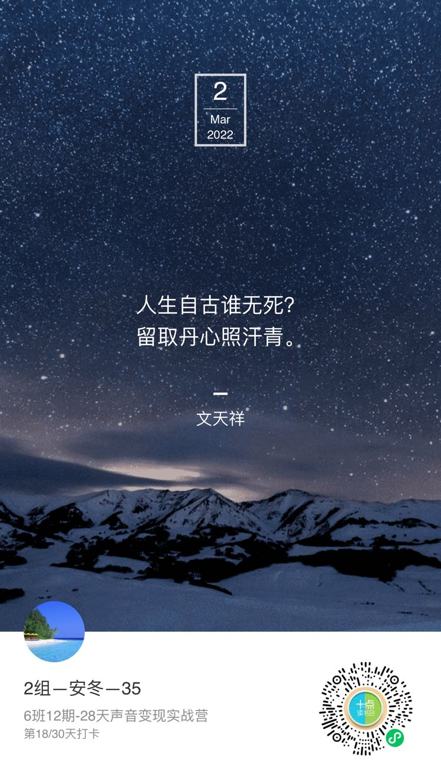
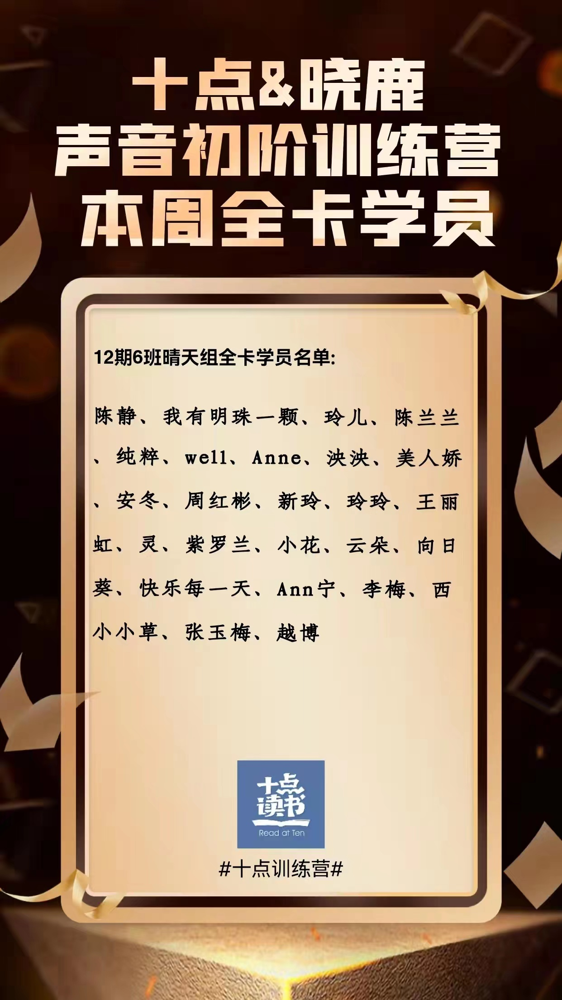

# 第三周每日打卡任务

学习形式：在小程序 `十点成长营` 中提交录音，完成打卡任务。（支持多次修改、上传多段录音）

> **Day15_2022-2-28：基本功打卡**

### **Day 15 基本功打卡**

:two_hearts: 温馨提示：这套练声技巧需要每天自己练习，帮大家养成习惯，练好口腔状态，才能说话圆润饱满

【练声要点】

:one: 闻花香发 `s` 音：口鼻迅速同时吸气，然后慢慢发“s”音，体会快吸慢呼，将“s”音尽量拉长慢慢呼出，体会绵延不断的气息将声音送出。（**2. 科学呼吸法**）

:two: 气泡音转中音区：发气泡音时注意不要压嗓子、憋气，而是体会气息顶着声音，咽喉不用力的感觉，体会声音的颗粒感和放松感，这相当于给咽喉做 SPA，完全放松咽喉。最后气息继续上顶，发出“啊”的声音，寻找中音区。（**5. 气泡音**）

:three: 发 `hei` `ha`（嘿哈）音，一口气发一声：只发“嘿”或“哈”，刚开始不要同时发，因为气息没到位、横膈膜没有完全激活，容易伤嗓子，循序渐进练习。体会强气息和横膈膜跳动配合带来的声音力量。

:four: 唇部操：可参考视频课晓鹿老师示范，按照要求和要领去做，动作要到位，感受唇部在做不同动作时的发力点，增加唇部力度。

:five: 舌部操：体会舌头的不同部位的发力和酸麻胀痛的感觉，这是舌头增加力度的必经过程。

> **Day16_2022-3-1：基本功打卡**

### **Day 16 基本功打卡**

:two_hearts: 温馨提示：这套练声技巧需要每天自己练习，帮大家养成习惯，练好口腔状态，才能说话圆润饱满

【练声要点】

:one: 闻花香发 `s` 音：口鼻迅速同时吸气，然后慢慢发“s”音，体会快吸慢呼，将“s”音尽量拉长慢慢呼出，体会绵延不断的气息将声音送出。（**2. 科学呼吸法**）

:two: 气泡音转中音区：发气泡音时注意不要压嗓子、憋气，而是体会气息顶着声音，咽喉不用力的感觉，体会声音的颗粒感和放松感，这相当于给咽喉做 SPA，完全放松咽喉。最后气息继续上顶，发出“啊”的声音，寻找中音区。（**5. 气泡音**）

:three: 发 `hei` `ha`（嘿哈）音，一口气发一声：只发“嘿”或“哈”，刚开始不要同时发，因为气息没到位、横膈膜没有完全激活，容易伤嗓子，循序渐进练习。体会强气息和横膈膜跳动配合带来的声音力量。

:four: 唇部操：可参考视频课晓鹿老师示范，按照要求和要领去做，动作要到位，感受唇部在做不同动作时的发力点，增加唇部力度。

:five: 舌部操：体会舌头的不同部位的发力和酸麻胀痛的感觉，这是舌头增加力度的必经过程。

> **Day17_2022-3-2：基本功打卡**

### **Day 17 基本功打卡**

:two_hearts: 温馨提示：这套练声技巧需要每天自己练习，帮大家养成习惯，练好口腔状态，才能说话圆润饱满 :blush:

【练声要点】

:one: 闻花香发 `s` 音：口鼻迅速同时吸气，然后慢慢发“s”音，体会快吸慢呼，将“s”音尽量拉长慢慢呼出，体会绵延不断的气息将声音送出。

:two: 气泡音转中音区。发气泡音时注意不要压嗓子、憋气，而是体会气息顶着声音，咽喉不用力的感觉，体会声音的颗粒感和放松感，这相当于给咽喉做SPA，完全放松咽喉。最后气息继续上顶，发出“啊”的声音，寻找中音区

:three: 发 `hei` `ha`（嘿哈）音，一口气发一声：只发“嘿”或“哈”，刚开始不要同时发，因为气息没到位、横膈膜没有完全激活，容易伤嗓子，循序渐进练习。体会强气息和横膈膜跳动配合带来的声音力量。

:four: 唇部操：可参考视频课晓鹿老师示范，按照要求和要领去做，动作要到位，感受唇部在做不同动作时的发力点，增加唇部力度。

:five: 舌部操：体会舌头的不同部位的发力和酸麻胀痛的感觉，这是舌头增加力度的必经过程

> **Day18_2022-3-3：基本功打卡**

### **Day 18 基本功打卡**

:two_hearts: 温馨提示：这套练声技巧需要每天自己练习，帮大家养成习惯，练好口腔状态，才能说话圆润饱满 :blush:

【练声要点】

:one: 闻花香发s音：口鼻迅速同时吸气，然后慢慢发“s”音，体会快吸慢呼，将“s”音尽量拉长慢慢呼出，体会绵延不断的气息将声音送出。

:two: 气泡音转中音区。发气泡音时注意不要压嗓子、憋气，而是体会气息顶着声音，咽喉不用力的感觉，体会声音的颗粒感和放松感，这相当于给咽喉做SPA，完全放松咽喉。最后气息继续上顶，发出“啊”的声音，寻找中音区

:three: 发 `hei` `ha`（嘿哈）音，一口气发一声：只发“嘿”或“哈”，刚开始不要同时发，因为气息没到位、横膈膜没有完全激活，容易伤嗓子，循序渐进练习。体会强气息和横膈膜跳动配合带来的声音力量。

:four: 唇部操：可参考视频课晓鹿老师示范，按照要求和要领去做，动作要到位，感受唇部在做不同动作时的发力点，增加唇部力度。

:five: 舌部操：体会舌头的不同部位的发力和酸麻胀痛的感觉，这是舌头增加力度的必经过程

> **Day19_2022-3-4：基本功打卡**

### **Day 19 基本功打卡**

:two_hearts: 温馨提示：这套练声技巧需要每天自己练习，帮大家养成习惯，练好口腔状态，才能说话圆润饱满 :blush:

【练声要点】

:one: 闻花香发s音：口鼻迅速同时吸气，然后慢慢发“s”音，体会快吸慢呼，将“s”音尽量拉长慢慢呼出，体会绵延不断的气息将声音送出。

:two: 气泡音转中音区。发气泡音时注意不要压嗓子、憋气，而是体会气息顶着声音，咽喉不用力的感觉，体会声音的颗粒感和放松感，这相当于给咽喉做SPA，完全放松咽喉。最后气息继续上顶，发出“啊”的声音，寻找中音区

:three: 发 `hei` `ha`（嘿哈）音，一口气发一声：只发“嘿”或“哈”，刚开始不要同时发，因为气息没到位、横膈膜没有完全激活，容易伤嗓子，循序渐进练习。体会强气息和横膈膜跳动配合带来的声音力量。

:four: 唇部操：可参考视频课晓鹿老师示范，按照要求和要领去做，动作要到位，感受唇部在做不同动作时的发力点，增加唇部力度。

:five: 舌部操：体会舌头的不同部位的发力和酸麻胀痛的感觉，这是舌头增加力度的必经过程

全勤考核：

第三周全勤打卡奖励：（待补）

