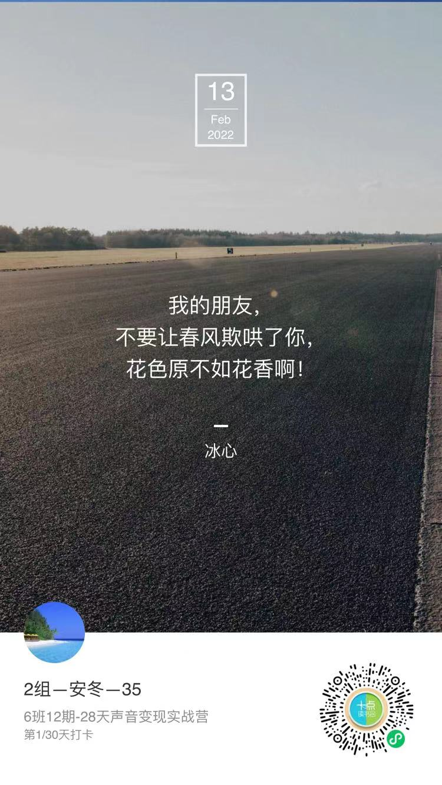
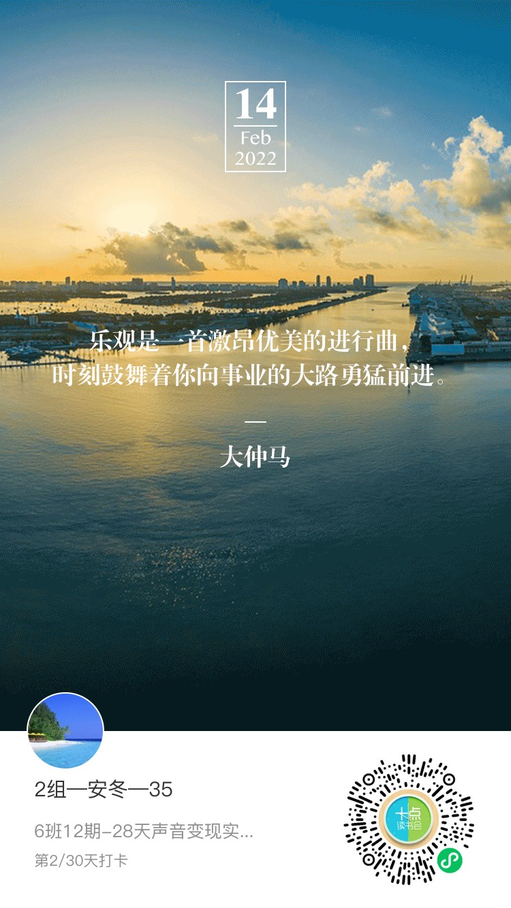
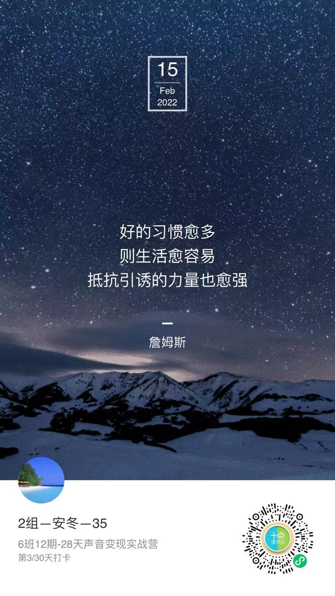

# 每日打卡任务

学习形式：在小程序 `十点成长营` 中提交录音，完成打卡任务。（支持多次修改、上传多段录音）

> **Day0_2022-2-13：开营仪式**

**Day 0 试打卡**

大家相互认识一下，定一个小目标💕

【打卡模板】

大家好，我是XXX，在中国-XX向你问好，愿你向鹿一样追逐，也像鹿一样优雅。
我会坚持每天完成当天的学习任务，坚持先完成后完美，坚持每天进步一点点，最后实现蜕变。
和群里的小伙伴一起共勉

提交语音文字：

大家好，我是安冬，在中国-四川向你问好！
愿你向鹿一样追逐，也像鹿一样优雅。
我会坚持每天完成当天的学习任务，
坚持先完成、后完美，
坚持每天进步一点点，最后实现蜕变。
和群里的小伙伴一起共勉～

开营典礼任务：用方言提交一段录音：

> 文稿：
>
> 新娘家。
> 新郎的一群兄弟，个个龙精虎猛，凶悍无比，眼中贼光直冒：“开门！快开门！接亲团到啦！”
> 门，吱一声，开了……
> 新娘的大姨叉着腰，一副包租婆状，横眉冷对：“吵吵啥？吵吵啥啊？！没化好呢，等着！”
> 以伴郎为首的兄弟们，气势彪悍地挺了挺胸肌,然后……腰板顿时一软,谄笑道：“啊，姨，那啥，没化好呢？嗯…好，不急，我们再等等……”
> 门，哐一声，又关上了……

共享文件：

<audio src="../assets/day0.m4a"></audio>

---

> **Day1_2022-2-14：基本功打卡**

**Day 1 基本功打卡**

:two_hearts: 温馨提示：这套练声技巧需要每天自己练习，帮大家养成习惯，练好口腔状态，才能说话圆润饱满

【练声要点】

:one: 闻花香发 `s` 音：口鼻迅速同时吸气，然后慢慢发“s”音，体会快吸慢呼，将“s”音尽量拉长慢慢呼出，体会绵延不断的气息将声音送出。（**2. 科学呼吸法**）

:two: 气泡音转中音区：发气泡音时注意不要压嗓子、憋气，而是体会气息顶着声音，咽喉不用力的感觉，体会声音的颗粒感和放松感，这相当于给咽喉做 SPA，完全放松咽喉。最后气息继续上顶，发出“啊”的声音，寻找中音区。（**5. 气泡音**）

:three: 发 `hei` `ha`（嘿哈）音，一口气发一声：只发“嘿”或“哈”，刚开始不要同时发，因为气息没到位、横膈膜没有完全激活，容易伤嗓子，循序渐进练习。体会强气息和横膈膜跳动配合带来的声音力量。

:four: 唇部操：可参考视频课晓鹿老师示范，按照要求和要领去做，动作要到位，感受唇部在做不同动作时的发力点，增加唇部力度。

:five: 舌部操：体会舌头的不同部位的发力和酸麻胀痛的感觉，这是舌头增加力度的必经过程。

> **Day2_2022-2-15：基本功打卡**

**Day2 基本功打卡**

